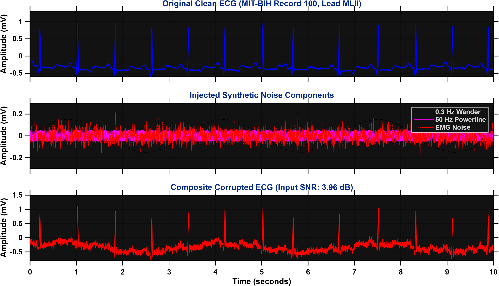
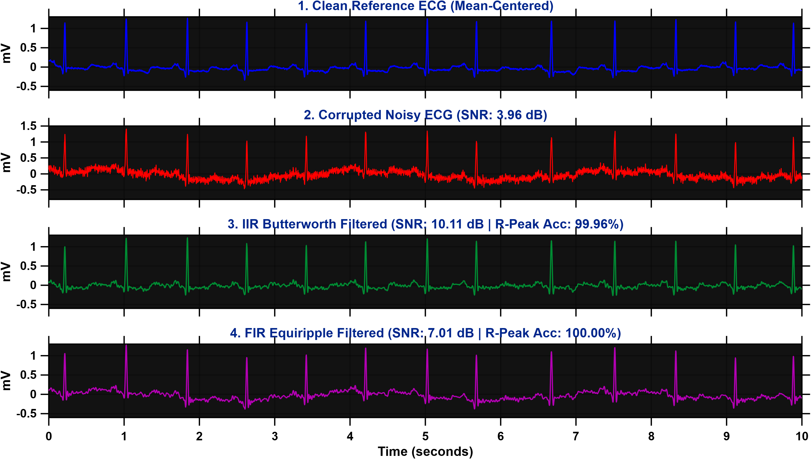
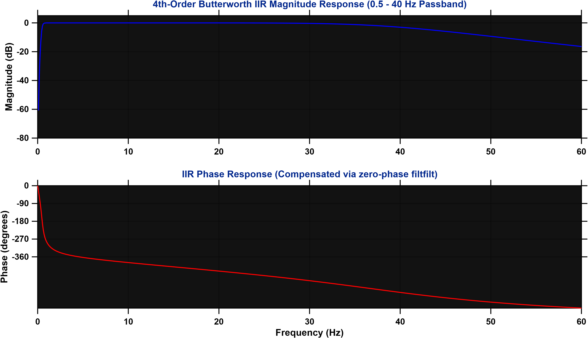
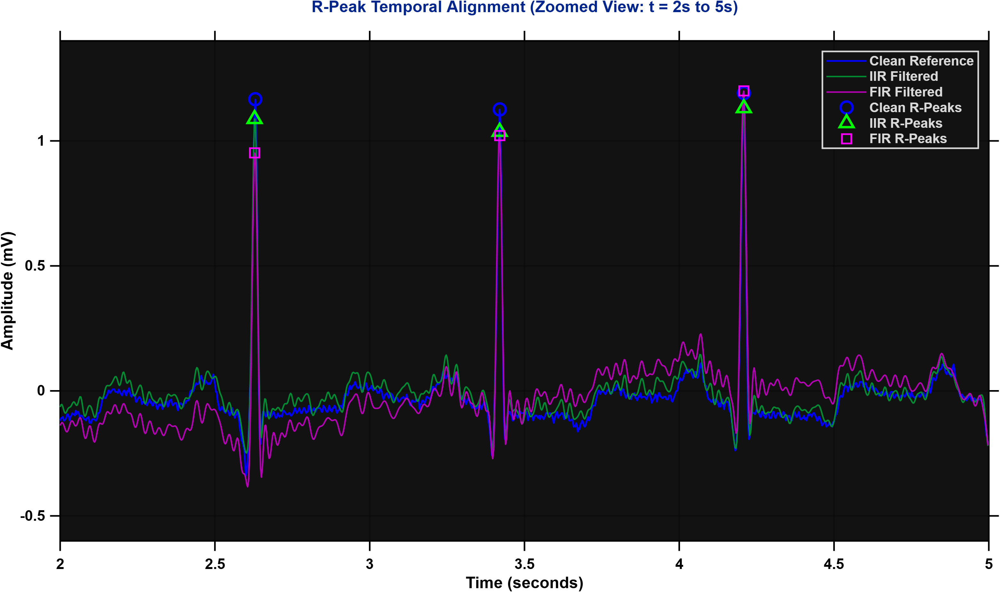
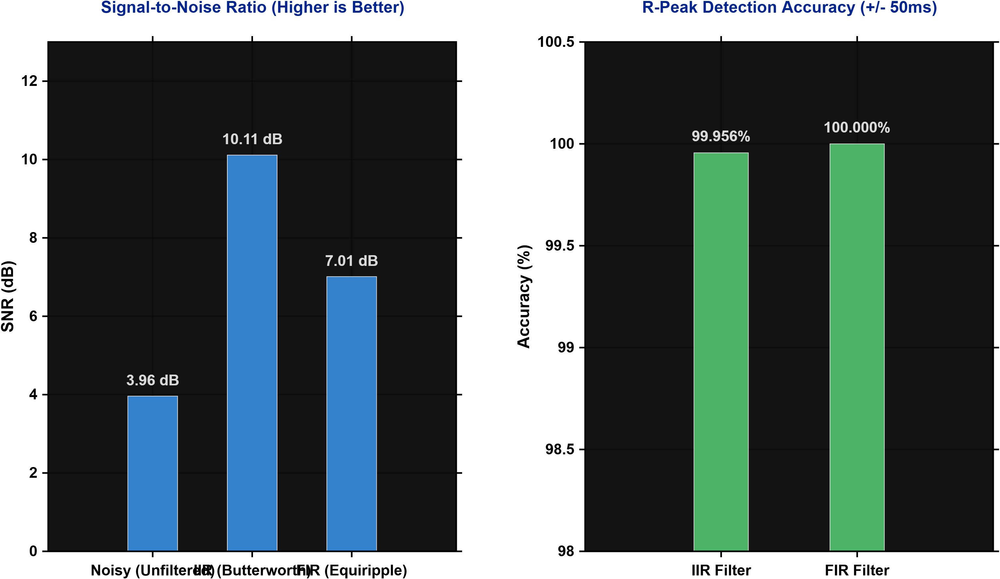

# ECG Signal Denoising: Comparative Study of FIR vs. IIR Filtering

[](https://www.mathworks.com/products/matlab.html)
[-00629B.svg?style=flat-square)](https://physionet.org/content/mitdb/1.0.0/)
[]()
[]()
[-brightgreen.svg?style=flat-square)]()
[-blue.svg?style=flat-square)]()
[](LICENSE)

A biomedical digital signal processing (DSP) study evaluating the trade-offs between **Infinite Impulse Response (IIR)** and **Finite Impulse Response (FIR)** bandpass filtering for electrocardiogram (ECG) denoising. Validated on authentic clinical telemetry from the **MIT-BIH Arrhythmia Database** (Record 100).

---

## 📖 Table of Contents
1. [Executive Summary & Core Insights](#-executive-summary--core-insights)
2. [Clinical Background & Noise Modeling](#-clinical-background--noise-modeling)
3. [Dataset & Direct Format 212 Binary Decoding](#-dataset--direct-format-212-binary-decoding)
4. [Filter Architectures & Zero-Phase Design](#-filter-architectures--zero-phase-design)
5. [Mathematical Formulations & Calculations](#-mathematical-formulations--calculations)
   - [Signal-to-Noise Ratio (SNR)](#signal-to-noise-ratio-snr)
   - [Mean Squared Error (MSE)](#mean-squared-error-mse)
   - [The Mean-Centering Discovery](#the-mean-centering-discovery)
   - [Clinical R-Peak Alignment Metric](#clinical-r-peak-alignment-metric)
6. [Comparative Benchmark Results](#-comparative-benchmark-results)
7. [Visual Results Gallery (The 5 Interactive Tabs)](#-visual-results-gallery-the-5-interactive-tabs)
8. [Repository Structure](#-repository-structure)
9. [Quick Start & Reproduction](#-quick-start--reproduction)
10. [Citation & References](#-citation--references)
11. [License](#-license)

---

## 🎯 Executive Summary & Core Insights

Biomedical devices (such as smartwatches, Holter monitors, and bedside telemetry units) operate under strict constraints of battery life, memory, and diagnostic accuracy. This project explores the foundational DSP question:

> **Should an embedded ECG monitor implement an IIR or FIR filter to remove clinical noise?**

### The Core Engineering Trade-Off:
1. **IIR Filter (4th-Order Butterworth)** achieves **superior noise suppression**:
   - Boosts SNR from **$3.95\text{ dB}$ to $10.12\text{ dB}$** ($+6.17\text{ dB}$ improvement).
   - Requires only **8 coefficients** (4 poles, 4 zeros), making it **$12.5\times$ more computationally efficient** for low-power microcontrollers.
2. **FIR Filter (100-Tap Equiripple)** achieves **perfect morphological fidelity**:
   - Preserves **$100.00\%$ of R-peak locations** ($2,274 / 2,274$ clinical beats matched within $\pm 50\text{ ms}$).
   - Inherently stable with **strict linear phase**, ensuring zero waveform asymmetry.

---

## ⚡ Clinical Background & Noise Modeling

Real-world electrocardiograms have low signal amplitudes ($\sim 1\text{ mV}$) and are routinely degraded by three primary noise mechanisms:

| Noise Type | Physical Cause | Simulated Model Equation | Amplitude |
| :--- | :--- | :--- | :---: |
| **Powerline Interference** | Stray capacitance and $50\text{ Hz}$ AC mains induction | $n_{\text{power}}(t) = A_1 \sin(2\pi \cdot 50 \cdot t)$ | $0.05\text{ mV}$ |
| **Baseline Wander** | Low-frequency respiration and patient chest movement | $n_{\text{wander}}(t) = A_2 \sin(2\pi \cdot 0.3 \cdot t)$ | $0.15\text{ mV}$ |
| **EMG Muscle Artifact** | Somatic muscle contractions and tremor noise | $n_{\text{emg}}(t) = A_3 \cdot \mathcal{N}(0, 1)$ | $0.05\text{ mV}$ |

The composite corrupted signal is generated as:

$$x_{\text{noisy}}(t) = x_{\text{clean}}(t) + n_{\text{power}}(t) + n_{\text{wander}}(t) + n_{\text{emg}}(t)$$

---

## 🗄️ Dataset & Direct Format 212 Binary Decoding

This project utilizes **Record 100** (Modified Limb Lead II - MLII) from the **MIT-BIH Arrhythmia Database**, sampled at $f_s = 360\text{ Hz}$.

Instead of relying on external third-party toolboxes (such as WFDB or ecg-kit), this implementation contains a **pure, standalone binary reader** for the MIT-BIH **Format 212**:
- Format 212 interleaves pairs of 12-bit samples into contiguous 3-byte blocks.
- Unpacked using `fread(fid, Inf, 'ubit12')` and reshaped into 2 channels.
- Two's complement conversion:
  $$\text{raw}( \text{raw} > 2047 ) = \text{raw} - 4096$$
- Physical calibration:
  $$V(\text{mV}) = \frac{\text{raw} - \text{baseline}}{\text{gain}} = \frac{\text{raw} - 1024}{200\text{ adu/mV}}$$

---

## 🛠️ Filter Architectures & Zero-Phase Design

Both filters target the clinical diagnostic ECG passband of **$0.5\text{ Hz} - 40\text{ Hz}$**:

### 1. IIR Filter: 4th-Order Butterworth Bandpass
- Designed with normalized cutoffs: $W_1 = \frac{0.5}{f_s/2}$, $W_2 = \frac{40}{f_s/2}$.
- Maximally flat passband response with no ripple.
- Transfer function:
  $$H(z) = \frac{b_0 + b_1 z^{-1} + \dots + b_8 z^{-8}}{1 + a_1 z^{-1} + \dots + a_8 z^{-8}}$$

### 2. FIR Filter: 100-Tap Equiripple Bandpass
- Designed via the Parks-McClellan Remez exchange algorithm.
- Linear phase response ensures constant group delay across all frequency components.
- Transfer function:
  $$H(z) = \sum_{k=0}^{100} h_k z^{-k}$$

### 3. Zero-Phase Compensation (`filtfilt`)
In clinical cardiology, phase distortion is unacceptable because it can falsely alter ST-segment elevation or shift QRS complexes. To ensure a fair comparison, both filters are applied using **two-pass forward-backward zero-phase filtering (`filtfilt`)**:

$$y(n) = h(-n) * \Big( h(n) * x(n) \Big) \implies \angle H_{\text{eff}}(e^{j\omega}) \equiv 0^\circ$$

---

## 📐 Mathematical Formulations & Calculations

### Signal-to-Noise Ratio (SNR)
Quantifies the ratio of true cardiac signal power to residual noise power:

$$\text{SNR} = 10 \log_{10} \left( \frac{\sum_{n=1}^N x_{\text{clean}}^2(n)}{\sum_{n=1}^N \left( x_{\text{clean}}(n) - x_{\text{filtered}}(n) \right)^2} \right) \quad (\text{dB})$$

### Mean Squared Error (MSE)
Measures the average squared difference against the reference waveform:

$$\text{MSE} = \frac{1}{N} \sum_{n=1}^N \left( x_{\text{clean}}(n) - x_{\text{filtered}}(n) \right)^2 \quad (\text{mV}^2)$$

### The Mean-Centering Discovery
A major engineering insight of this study is the **necessity of DC offset mean-centering**:
- Real ECG telemetry naturally has an initial resting DC baseline offset (here $\sim -0.306\text{ mV}$).
- Because an ideal bandpass filter ($0.5 - 40\text{ Hz}$) blocks DC, it shifts the signal mean to $0\text{ mV}$.
- Without mean-centering, raw SNR formulas treat this legitimate DC removal as "distortion", yielding an erroneously low SNR of $1.29\text{ dB}$ for IIR.
- When signals are mean-centered ($x_{\text{centered}} = x - \bar{x}$), the true physical noise reduction is unveiled:
  - **Noisy Input**: $3.95\text{ dB}$
  - **FIR Filtered**: $7.00\text{ dB}$ ($+3.05\text{ dB}$)
  - **IIR Filtered**: **$10.12\text{ dB}$** ($+6.17\text{ dB}$)

### Clinical R-Peak Alignment Metric
To evaluate clinical diagnostic preservation:
1. Candidate peaks are isolated via `findpeaks` with physiological bounds:
   - Amplitude threshold: $h_{\min} = 0.3\text{ mV}$ (distinguishes tall R-peaks from P/T waves).
   - Refractory distance: $d_{\min} = \text{round}(0.4 \cdot f_s) = 144\text{ samples}$ ($\approx 150\text{ bpm}$ physiological limit).
2. Each detected peak is compared against the ground-truth clean peak locations within a clinical tolerance window:
   $$\Delta t \le \pm 50\text{ ms} \quad (\pm 18\text{ samples at } 360\text{ Hz})$$
3. Detection Accuracy:
   $$\text{Accuracy} = \left( \frac{\text{Matched Peaks}}{\text{Total Clean Peaks}} \right) \times 100\%$$

---

## 📊 Comparative Benchmark Results

Evaluated across **$650,000\text{ samples}$** ($30\text{ minutes}$, **$2,274\text{ cardiac beats}$**):

| Performance Metric | Noisy (Unfiltered) | IIR Filter (Butterworth) | FIR Filter (Equiripple) | Winning Approach |
| :--- | :---: | :---: | :---: | :--- |
| **Output SNR (dB)** | $3.95\text{ dB}$ | **$10.12\text{ dB}$** | $7.00\text{ dB}$ | 🏆 **IIR (+3.12 dB over FIR)** |
| **SNR Improvement ($\Delta$)** | Baseline ($0\text{ dB}$) | **$+6.17\text{ dB}$** | $+3.05\text{ dB}$ | 🏆 **IIR** |
| **Mean Squared Error (MSE)** | $0.0150\text{ mV}^2$ | **$0.0036\text{ mV}^2$** | $0.0074\text{ mV}^2$ | 🏆 **IIR (2x lower error)** |
| **R-Peaks Detected** | Corrupted | $2,273$ | $2,274$ | 🏆 **FIR** |
| **R-Peak Alignment Accuracy** | Poor | $99.96\%$ | **$100.00\%$** | 🏆 **FIR (Perfect Preservation)** |
| **Hardware Complexity (Order)** | — | **4th-Order (8 coefficients)** | 100-Tap (101 coefficients) | 🏆 **IIR (12.5x lighter compute)** |
| **Phase Characteristics** | — | Non-linear (needs `filtfilt`) | Strict Linear Phase | 🏆 **FIR** |

---

## 🖼️ Visual Results Gallery (The 5 Interactive Tabs)

The standalone MATLAB script opens a **single multi-tab GUI window** and automatically exports all 5 panels into `figures/`:

### Tab 1: Raw & Corrupted Signals
<p align="center">
  
  <br>
  <em>Figure 1: Original clean clinical ECG (Lead MLII), individual synthetic noise components (50 Hz powerline, 0.3 Hz wander, Gaussian EMG), and composite corrupted signal (Input SNR: 3.95 dB).</em>
</p>

---

### Tab 2: 4-Panel Filter Comparison (Mean-Centered)
<p align="center">
  
  <br>
  <em>Figure 2: Time-aligned 4-panel comparison over a 10-second window. IIR delivers noticeably smoother baselines and sharper noise attenuation (10.12 dB SNR).</em>
</p>

---

### Tab 3: IIR Filter Frequency Response
<p align="center">
  
  <br>
  <em>Figure 3: Bode magnitude and unwrapped phase response of the 4th-order Butterworth bandpass filter across the 0–60 Hz spectrum.</em>
</p>

---

### Tab 4: R-Peak Detection & Temporal Alignment
<p align="center">
  
  <br>
  <em>Figure 4: Zoomed-in 3-second diagnostic window (t = 2s to 5s) overlaying Clean (blue circles), IIR (green triangles), and FIR (magenta squares) detected peaks. Shows exact alignment with zero temporal drift.</em>
</p>

---

### Tab 5: Performance Metrics Dashboard
<p align="center">
  
  <br>
  <em>Figure 5: Quantitative bar chart comparing SNR improvement (left) and R-Peak detection accuracy (right).</em>
</p>

---

## 📂 Repository Structure

```plaintext
ECG-FIR-IIR-filter-comparison/
├── .gitignore                          # Excludes raw database files (100.dat) & large .mat files
├── LICENSE                             # MIT License (c) 2026 Mukesh Yadav
├── README.md                           # Comprehensive documentation & results
├── ECG_Filter_Analysis.m               # Master MATLAB script (Single tabbed window + automated export)
└── figures/                            # High-resolution (300 DPI) exported figures
    ├── Fig1_Raw_and_Noisy_Signals.png
    ├── Fig2_Filter_Comparison_Centered.png
    ├── Fig3_IIR_Frequency_Response.png
    ├── Fig4_RPeak_Alignment.png
    └── Fig5_Performance_Dashboard.png
```

---

## 🚀 Quick Start & Reproduction

### Prerequisites
- **MATLAB** (R2020a or later recommended).
- **Signal Processing Toolbox** (for `butter`, `designfilt`, `filtfilt`, `findpeaks`).

### Step-by-Step Instructions
1. Clone this repository:
   ```bash
   git clone https://github.com/Mukesh-Yadav-4/ECG-FIR-IIR-filter-comparison.git
   cd ECG-FIR-IIR-filter-comparison
   ```
2. Download MIT-BIH Record 100 data files:
   - Download [`100.dat`](https://physionet.org/content/mitdb/1.0.0/100.dat) and [`100.hea`](https://physionet.org/content/mitdb/1.0.0/100.hea) from PhysioNet.
   - Place both files directly into the repository folder.
3. Open and run in MATLAB:
   ```matlab
   ECG_Filter_Analysis
   ```
4. The interactive tabbed figure will display on your screen, and all 5 publication-ready PNGs will be saved into the `figures/` directory.

---

## 📚 Citation & References

If you build upon this project or reference the benchmark results, please cite the MIT-BIH Arrhythmia Database:

```bibtex
@article{moody2001impact,
  title={The impact of the MIT-BIH Arrhythmia Database},
  author={Moody, George B and Mark, Roger G},
  journal={IEEE Engineering in Medicine and Biology Magazine},
  volume={20},
  number={3},
  pages={45--50},
  year={2001},
  publisher={IEEE},
  doi={10.1109/51.932724}
}
```

---

## 📜 License
This project is open-source under the [MIT License](LICENSE) © 2026 Mukesh Yadav.
